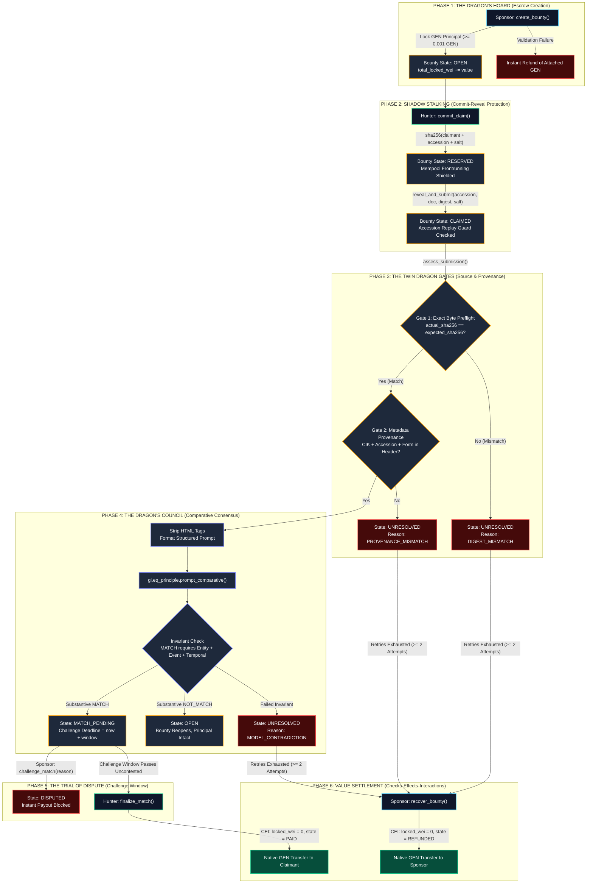

# DracoLatch

> **Autonomous Corporate Disclosure Escrow & Verification Vault on GenLayer**  
> *Governed by Multi-Validator Comparative Consensus, Cryptographic Commit-Reveal, and Sovereign SEC EDGAR Provenance.*

---

## Executive Overview

**DracoLatch** is a decentralized, evidence-conditioned escrow protocol built natively for GenLayer Intelligent Contracts. It allows any capital allocator or analyst (**Sponsor**) to fund a high-stakes bounty in native GEN conditioned on a precise corporate disclosure requirement—such as an executive resignation, merger agreement, or regulatory enforcement action.

Evidence hunters (**Claimants**) fulfill the bounty by submitting canonical U.S. Securities and Exchange Commission (SEC) EDGAR filing identifiers. Instead of trusting an off-chain oracle or centralized escrow agent, independent GenLayer validators:
1. Construct authoritative archive URLs directly from company CIK and accession numbers;
2. Verify exact-byte cryptographic integrity (SHA-256) and SEC header provenance;
3. Evaluate natural language disclosure compliance using the Equivalence Principle (`prompt_comparative`); and
4. Atomically disburse escrowed GEN or reopen the bounty.

## Live Deployment

- **Deployed Contract:** [`0x378640F3dbfC35F162945D12B73234138e211Bb6`](https://explorer-studio-next.genlayer.com/address/0x378640F3dbfC35F162945D12B73234138e211Bb6)
- **Network:** GenLayer Studio Next (Chain `61997`)
- **Diagnostic Source Probe:** [`0x60d3f54658b15b07F29f08103317324a876CF638`](https://explorer-studio-next.genlayer.com/address/0x60d3f54658b15b07F29f08103317324a876CF638)
- **Contract Source Parity:** 100% byte-for-byte verified via RPC (`tools/fetch_genlayer_contract.py`)
- **E2E Evidence Matrix:** [`E2E_EVIDENCE.md`](E2E_EVIDENCE.md)

---

```
                              /\             /\
                             /  \           /  \
                            / /\ \         / /\ \
                           / /  \ \       / /  \ \
                          / /    \ \     / /    \ \
                         /_/      \_\   /_/      \_\
                                  | |   | |
       ___________________________| |___| |___________________________
      /                                                               \
     |              DRACOLATCH: THE DRAGON VAULT PROTOCOL              |
     |         Evidence-Conditioned Capital Latch on GenLayer          |
      \_______________________________________________________________/
                                  \       /
                                   \     /
                                    \   /
                                     \ /
                                      V
```

---

## The Dragon Flow Chart



---

## Core Architectural Innovations

### 1. Commit-Reveal Anti-Frontrunning Guard
In disclosure bounties, naive implementations accept plain accession numbers in submission calls. Because SEC filings are public, MEV searchers can observe the mempool, copy the accession and digest, and steal the hunter's bounty. DracoLatch implements an on-chain commit-reveal protocol:
$$\text{commitment} = \text{SHA256}(\text{claimant\_address} \parallel \text{accession} \parallel \text{salt})$$
Only the address that submitted the original commitment can reveal the filing and claim the reward.

### 2. Active Challenge & Dispute Mechanism
Rather than treating the challenge window as a passive delay, DracoLatch provides `challenge_match(submission_id, reason)`. During the challenge window, the Sponsor can formally dispute a false-positive match, halting automated finalization and transitioning the contract to `DISPUTED`.

### 3. Context-Preserving HTML Sanitization
SEC EDGAR filings contain extensive raw HTML tags, `<style>` definitions, and script tags that consume thousands of prompt tokens and trigger delimiter collisions. DracoLatch sanitizes filing text on-chain prior to prompt execution, preserving model reasoning bandwidth.

### 4. Cross-Field Logical Invariants
The contract enforces strict multi-boolean invariant validation inside validator evaluation:
$$\text{verdict} = \text{MATCH} \iff (\text{entity\_match} \land \text{material\_event\_match} \land \text{temporal\_match})$$
Contradictory model outputs fail closed immediately as `UNRESOLVED / MODEL_CONTRADICTION`.

---

## Contract Method Index

### Write Methods (6 Operational + 3 Enhanced)

| Method | Role | Payable | Description |
| :--- | :--- | :--- | :--- |
| `create_bounty(...)` | Sponsor | **Yes** | Funds a new disclosure requirement; refunds invalid deposits |
| `commit_claim(...)` | Hunter | No | Reserves claim slot with `sha256(claimant + accession + salt)` |
| `reveal_and_submit(...)` | Hunter | No | Reveals committed accession and establishes submission entry |
| `submit_direct(...)` | Hunter | No | Direct submission pathway for open/uncontested bounties |
| `assess_submission(...)` | Participant | No | Multi-validator SEC retrieval and comparative LLM consensus |
| `challenge_match(...)` | Sponsor | No | Registers formal dispute during open challenge window |
| `retry_unresolved(...)` | Participant | No | Re-opens assessment for failed rounds (max 2 attempts) |
| `finalize_match(...)` | Claimant | No | Clears liability and executes payout after challenge window |
| `recover_bounty(...)` | Sponsor | No | Recovers principal if deadline expired or retries exhausted |

### View Methods

| Method | Returns | Description |
| :--- | :--- | :--- |
| `get_protocol()` | `dict` | Protocol version, capabilities, and authority metadata |
| `get_bounty(id)` | `dict` | Full bounty record, deadlines, and locked principal |
| `get_submission(id)` | `dict` | Submission state, digests, attempts, and reason codes |
| `get_totals()` | `dict` | Aggregate locked, paid, and refunded GEN accounting |

---

## Local Verification Suite

Run all unit tests, contract linters, and validations with a single command:

```bash
# Execute full verification pipeline
./scripts/verify_local.sh
```

Or run individual components:

```bash
# 1. Run Python unit & adversarial test suite (14 tests)
python3 -m pytest -v tests/test_draco_latch.py

# 2. Check DracoLatch against official GenVM linter
python3 -m genvm_linter.cli check contracts/draco_latch.py

# 3. Check DracoSourceProbe against official GenVM linter
python3 -m genvm_linter.cli check contracts/draco_source_probe.py

# 4. Build frontend production bundle
cd frontend && npm install && npm run build
```

---

## Deployment & Verification Order

### Step 1: Preflight Source Probe
1. Deploy `contracts/draco_source_probe.py` on GenLayer Studio Net (or Studio Next).
2. Call `probe_sec_endpoint`.
3. Verify that the finalized on-chain result is:
   ```text
   200:38298:79d278b5c34a40ec5618d5286c983120346ebb58ccd8587339533b88e7f22e37
   ```

### Step 2: Main Custody Deployment
1. Deploy `contracts/draco_latch.py` without constructor parameters. The deployer receives zero special privileges.
2. Record the deployed contract address.

### Step 3: Frontend Launch
1. Copy `frontend/.env.example` to `frontend/.env` and set:
   ```env
   VITE_CONTRACT_ADDRESS=<DEPLOYED_CONTRACT_ADDRESS>
   VITE_GENLAYER_NETWORK=studionet
   ```
2. Build and publish:
   ```bash
   cd frontend && npm run build
   ```

---

## Economic Security & Invariant Proofs

See [`docs/economic-security.md`](docs/economic-security.md) for the full custody threat model.

- **Zero-Drift Conservation:** $\text{total\_locked} = \sum b.\text{locked\_wei}$.
- **One-Way Terminal States:** Once `PAID` or `REFUNDED`, a bounty cannot transition or disburse funds again.
- **Fail-Closed Guarantees:** Network timeouts, SEC rate-limits, malformed JSON, and model contradictions all result in `UNRESOLVED`, never releasing funds.

---

## Disclaimer

This software demonstrates evidence-conditioned escrow authorization using GenLayer Intelligent Contracts. It is for research and experimental purposes and does not constitute financial, legal, or investment advice.
